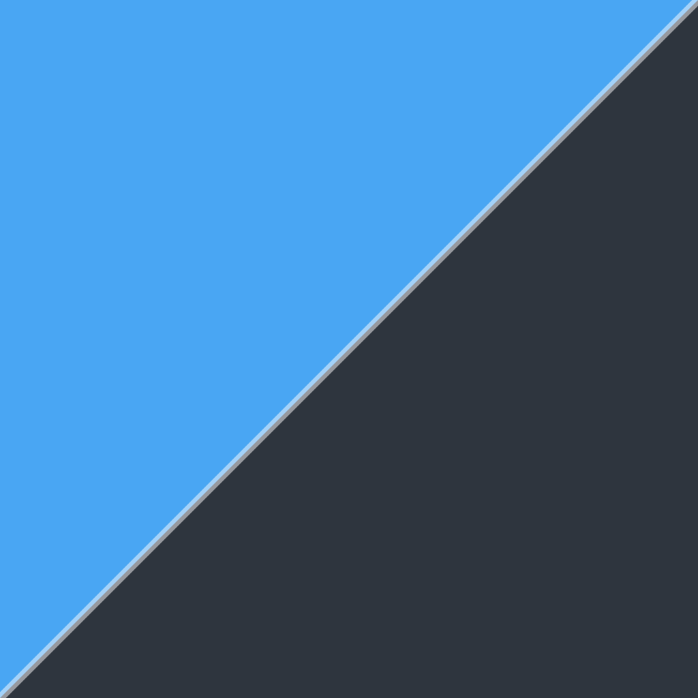
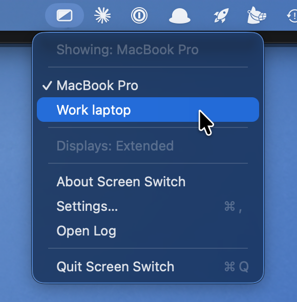

<p align="center">
  
</p>

<h1 align="center">Screen Switch</h1>

<p align="center">
  Two machines, one monitor. Hand the monitor over to the other machine and get
  your Mac's windows back onto its own screen — from the menu bar, a hotkey, or
  automatically when the monitor's input changes.
</p>

---

## The problem

You have a Mac and one other machine — a work laptop, a desktop, a console — and
they share a single external monitor. You switch the monitor over to the other
machine with its buttons, and now half your Mac is invisible: macOS still thinks
the big display is there, so windows sit on a screen nobody can look at. You drag
them back one by one, or you turn on mirroring — which makes your laptop screen
adopt the monitor's resolution and turns everything tiny, so you head into System
Settings to fix *that*. Then you do the whole dance again in reverse when you
switch back.

Screen Switch makes it one click. Pick a machine from the menu bar and the
monitor switches to it while your Mac rearranges itself to match — mirrored onto
your own screen at your own resolution when the monitor is away, back to your
normal arrangement when it returns. Switch inputs at the monitor itself and the
Mac notices and catches up on its own.

**Apple Silicon Macs only.** Screen Switch talks to the monitor over DDC/CI using
`m1ddc`, which does not support Intel Macs.

## Install

### Prerequisites

- An Apple Silicon Mac
- An external monitor that supports DDC/CI input switching (most do)
- [Homebrew](https://brew.sh)
- Xcode command line tools, for the Swift compiler:

  ```bash
  xcode-select --install
  ```

- Two command line tools, both in homebrew-core — no tap needed:

  ```bash
  brew install displayplacer m1ddc
  ```

### Build and install

```bash
git clone https://github.com/edwinm/screen-switch.git
cd screen-switch
./build
open "Screen Switch.app"
```

`build` compiles the menu bar app into `Screen Switch.app` and ad-hoc signs it.
Opening it puts the icon in your menu bar; tick **Settings… → General → Start
Screen Switch at login** to have it come back at every login.

`./install-agent` is the other way to do that, from the command line. Use one or
the other. See
[Starting, stopping, and removing the app](#starting-stopping-and-removing-the-app).

There is no download to grab: the app runs Homebrew binaries and drives DDC,
which the App Sandbox forbids, so it is distributed as source you compile
yourself. See [It is not sandboxed, and not notarised](#it-is-not-sandboxed-and-not-notarised)
for what that means in practice.

### First-time setup

Open **Settings…** from the menu bar icon. It detects your displays by name and
fills in almost everything. Two things are left for you:

1. **Displays → Capture Current Arrangement.** Arrange your screens in System
   Settings the way you normally want them, with mirroring *off*, then capture.
   That is the layout Screen Switch returns to.
2. **Devices → +.** Add each machine that shares the monitor. Switch the monitor
   to that machine with its own buttons, click **Use Monitor's Current Input**,
   and the input code is read straight off the monitor — no probing, no guessing
   which number your panel uses for which port. Name it, choose whether that
   machine means *Extended* (your arrangement — this Mac) or *Mirrored*
   (everything on your own screen), and you are done.

Settings apply as you make them; there is no Save button and nothing needs a
restart. Your configuration lives in `~/.config/screen-switch/`, outside the
checkout, so pulling a new version never touches it.

## Use

### From the menu bar

<p align="center">
  
</p>

Click the icon and you get a menu of your machines, with a checkmark on whichever
one the monitor is currently showing, plus the current display mode. Pick a
machine and the monitor switches to it and the Mac applies the matching layout.
Below that: **About Screen Switch**, **Settings…**, **Open Log**, and **Quit**.

The icon itself shows the state at a glance: extended, mirrored, or monitor
unreachable.

You do not have to use the menu. Switch inputs with the monitor's own buttons and
the app notices within a few seconds and adjusts the Mac to match.

### From the command line

The same work is available as a shell tool you can run directly:

```bash
./screen-switch toggle
```

| verb | does |
| --- | --- |
| `toggle` | extended → mirrored, or back. This is what a hotkey would run. |
| `mirrored` | mirror onto your own screen, then hand the monitor over |
| `extended` | restore your captured arrangement |
| `status` | prints `extended` or `mirrored` |
| `input` | prints the monitor's current input code; `input <code>` sets it |
| `discover` | dumps the raw values Settings… reads |

`mac` and `work` still work as aliases for `extended` and `mirrored`.

If the shared monitor is not connected at all, every verb is a clean no-op.

### A keyboard shortcut

The menu bar app covers the clicking. If you also want a key combo, wrap the
script in a Shortcut:

1. Shortcuts → Settings → Advanced → enable **Allow Running Scripts**. Nothing
   runs until this is on.
2. New shortcut named e.g. **Toggle Monitor**, containing a single **Run Shell
   Script** action with the full path to `screen-switch` in this checkout, plus
   `toggle`. Leave the shell as `/bin/bash` and "Pass Input" as *to stdin*.
3. In the shortcut's details pane, set a **keyboard shortcut**.
4. Run it once and approve the permission prompt.

Shortcuts runs scripts with a minimal `PATH`, which is why the config stores
absolute paths to `displayplacer` and `m1ddc` rather than relying on the shell to
find them.

### Starting, stopping, and removing the app

**Settings… → General → Start Screen Switch at login** is the simple route. It
appears in System Settings → General → Login Items under **Allow in the
Background**, as *Screen Switch.app* with its own icon, where you can also
switch it off. **Quit** in the menu quits it; open the app again to bring it
back.

The registration remembers where the app is, so if you move the checkout, turn
the setting off and on again.

The command line route does the same thing from outside the app:

```bash
./install-agent            # install as a login item, and start it
./install-agent start      # start it again after using Quit in the menu
./install-agent stop       # stop it until next login
./install-agent status     # running? installed?
./install-agent uninstall  # stop it and remove it from login items
```

With the agent installed, **Quit** in the menu stops it until your next login. To
bring it back without logging out, use `install-agent start` (or just open
`Screen Switch.app`).

Activity goes to `~/Library/Logs/screen-switch.log` (the **Open Log** menu item).
On the `install-agent` route, launchd's own stdout/stderr go to
`~/Library/Logs/screen-switch.agent.log` as well; the checkbox's agent sends
them to the unified log instead.

### Why the entry says "Screen Switch.app"

Because Finder is set to show every filename extension — with that on, macOS
appends `.app` to every application's name, and Login Items shows the same
string for all of them. Turning off **Finder → Settings → Advanced → Show all
filename extensions** drops the suffix everywhere, including here. Nothing in
the app can override it.

### Why the install-agent entry looks like a stray Unix binary

Installed with `install-agent`, the Login Items row reads **ScreenSwitch** with
a generic executable icon and "part of an unknown developer", rather than
*Screen Switch.app* with its icon. That is the ad-hoc signature: the plist's
`AssociatedBundleIdentifiers` only maps the job back to the app when the two
share a Developer ID team, and an ad-hoc signature has no team, so macOS
describes the program launchd runs instead.

The checkbox in Settings has no such problem — the agent it registers is
inside the app bundle, so the row is the app. If the tidy entry matters to you,
use the checkbox and `./install-agent uninstall` the launchd job.

### If the menu bar icon does not appear

The menu bar has less room than it looks. On a notched MacBook Pro, status items
cannot flow past the notch, so the only usable space is the strip to its *right* —
the wide gap to the left of the notch is not available. When that strip is full,
macOS silently drops new items: the item still reports `isVisible = true` with a
valid button, it simply is not drawn, and there is no error anywhere.

If the icon is missing, remove another menu bar icon to free a slot. That is the
whole fix.

## Known limitation

Window positions are not preserved across a mirror round-trip. macOS squeezes
windows onto the smaller logical desktop and does not put them back afterwards.
Restoring window geometry is a much bigger job and is deliberately not attempted
here.

---

# Technical details

## How it works

`displayplacer` sets the mirroring *and* the resolution in one atomic call, so
the wrong resolution never gets a chance to appear.

The trick is which screen leads the mirror set. displayplacer's own note:

> The first screenId in a mirroring set will be the 'Optimize for' screen in the
> system prefs. You can only choose resolutions for the 'Optimize for' screen.

So your own screen is listed first (`id:<yours>+<monitor>`). Its resolution
becomes the mode that gets set, and the monitor hardware-scales a copy that
nobody is looking at. The monitor's own modes never enter into it. Screen Switch
always generates the mirror set in that order, so this is not something you can
get wrong by hand.

`m1ddc` then sends the DDC/CI input-select command (VCP `0x60`) to move the
monitor over to the other machine.

Going back to extended, the script tries to pull the monitor's input back over
DDC. Whether that works is a property of your monitor: some keep answering DDC
while showing another machine, some drop the channel with the picture. If yours
does not cooperate, press its input button and then run the command — or turn the
attempt off in Settings → General.

## Input codes are per-monitor

The DDC spec assigns VCP `0x60` values to input sources — commonly 15 and 16 for
DisplayPort 1 and 2, 17 and 18 for HDMI 1 and 2, 27 for USB-C — but monitors
disagree, and some accept a value and then quietly ignore it. Nothing here
assumes a numbering: **Use Monitor's Current Input** reads the live value from
your panel, which is right by construction.

Two behaviours worth knowing if you do go probing:

- **A successful `set` does not mean the input changed.** Some monitors return
  success and stay where they were. `set_input` verifies by reading the input
  back rather than trusting the exit code.
- **Reads taken right after a set can be transient.** A value read mid-switch may
  be neither the old nor the new one. `set_input` polls for up to six seconds
  rather than reading once.

### Some inputs can strand you

On certain panels, selecting a particular input drops the link to the Mac
entirely: the display vanishes from macOS *and* the DDC channel goes with it, so
nothing running on the Mac can undo it and only the monitor's own buttons bring
it back.

Measured example: on a **DELL U2718Q**, input 15 (DisplayPort 1) does exactly
this — DisplayPort and mDP evidently share a link on that panel. HDMI 1 does not;
the mDP link stays up and DDC keeps answering.

If you find such an input on your monitor, put it in **Settings → Advanced →
Never select inputs**. The list is empty by default, because which codes are safe
is a property of your hardware and blocking a number that is a perfectly good
DisplayPort input elsewhere would be worse than useless.

## What DDC cannot tell you

There is no MCCS code for "is there a signal on input X" — you can read which
input is *selected*, never which ones are live. With another machine powered and
outputting on a different input, every DDC value reads back byte-identical to
baseline and macOS sees nothing at all.

So the monitor cannot tell you the other machine booted. It can only tell you
which machine currently owns the monitor. That is still the best available signal
for automation, and it needs no software on the other machine — but it follows
the *monitor's* input selection, not any machine's power state.

## Why it is edge-triggered

The app acts only when the input actually *changes* — never on steady state. That
is what stops it fighting you: mirror by hand while the monitor stays on the Mac
and there is no edge, so your choice stands. A level-triggered version would
quietly undo it a few seconds later, every time.

Two things count as edges: the input value changed, or DDC came back after being
unreachable (the monitor may have dropped the Mac's display while it was away,
leaving macOS on one screen with the layout still to restore). Values are
debounced over two consecutive identical reads, because reads taken mid-switch
return transients.

## Auto Select only helps in one direction

With the monitor's **Auto Select** on, disconnecting the other machine makes the
monitor fall back to the Mac, and the watcher restores your arrangement — fully
automatic. Connecting it does *not* switch the monitor: Auto Select scans for a
new input only when the current one dies, and a Mac that is always awake never
loses its input, so the arriving machine never wins.

So starting work needs one gesture — the menu, or the monitor's own buttons — and
ending it needs none. That asymmetry is worth knowing about: arrival is a
decision, departure is an event.

## The agent and launchd

`Screen Switch.app` is a native AppKit menu bar app. It shells out to
`screen-switch` for the actual display work, so the shell script stays the single
source of truth and the app is only the UI in front of it.

Both routes end up as a launchd job, so this applies either way. Note that
`launchctl kill SIGTERM` does *not* stop it: `KeepAlive` is set to
`SuccessfulExit: false`, so a signal counts as an unsuccessful exit and launchd
restarts it within seconds. That setting is what makes the menu's **Quit** work —
a clean exit stays quit — so `install-agent stop` unloads the job with `bootout`
instead. The plist stays in place, so it returns at the next login either way.

## It is not sandboxed, and not notarised

The app runs Homebrew binaries and drives DDC, which the App Sandbox forbids, so
it is distributed as source you compile yourself and `build` signs it ad-hoc.
That is also why there is no download: an ad-hoc signed binary from a stranger is
not something you should run, and a notarised one would need a paid Developer ID
for a utility this small. `Developer Name: (null)` in Login Items is expected.

## Files

```
Screen Switch.app       the menu bar app (build creates the binary inside it)
main.swift              entry point
ScreenSwitch.swift      status item, menu, and the edge-triggered watcher
Config.swift            reading and writing the config
Displays.swift          display detection: displayplacer + m1ddc + CoreGraphics
SettingsWindow.swift    the Settings window
LoginItem.swift         the start-at-login setting (SMAppService)
screen-switch           the shell tool that does the display work; usable alone
lib.sh                  shared shell helpers
build                   swiftc + codesign
install-agent           the command line alternative to the checkbox
config.example.sh       an annotated config, if you would rather write one
devices.example.conf    likewise for the machine list
icons/                  app and menu bar icons, plus the script that renders them
```

Your own settings, written by Settings… and read by the shell tool:

```
~/.config/screen-switch/config.sh
~/.config/screen-switch/devices.conf
```

`screen-switch` also accepts `$SCREEN_SWITCH_CONFIG`, and falls back to a
`config.sh` next to itself, which is handy for testing.

## License

MIT — see [LICENSE](LICENSE).
